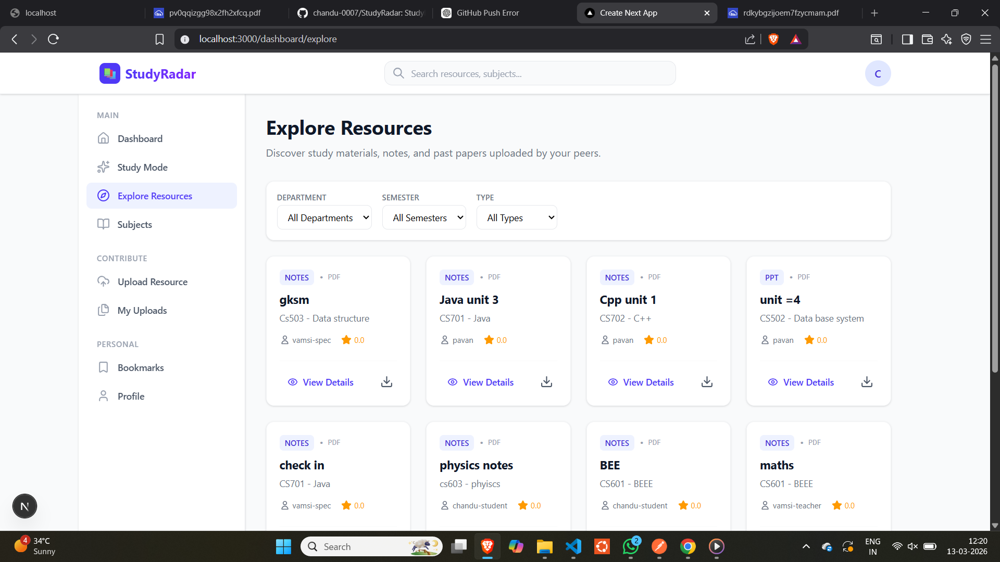

# StudyRadar 📚⚡

**AI-Powered Academic Resource Discovery Platform**

StudyRadar is a platform designed to help students quickly discover reliable academic resources aligned with their course requirements—especially during exam week when time is limited and resources are scattered.

Students often struggle to find the right notes, past papers, or explanations because materials are spread across WhatsApp groups, Google Drive folders, Telegram channels, and learning portals. StudyRadar centralizes these resources into one organized platform and enhances discovery with AI-powered search.

---

## 🚀 Problem Statement

During exam season, students urgently need:

* Notes
* PPTs
* Past exam papers
* Textbooks
* Quick explanations

However, these resources are scattered across different platforms and poorly organized. Students spend more time searching for study materials than actually studying.

**Goal:**
Create a system that helps students **discover the right academic resources quickly and efficiently**, aligned with their course syllabus.

---

## 💡 Solution

StudyRadar provides a centralized academic resource platform where students can:

* Upload and share study materials
* Discover curated and highly rated resources
* Search resources using AI-powered queries
* Get exam-focused insights such as important topics and past paper patterns

The platform organizes resources by **subject, semester, department, and unit**, making discovery intuitive and fast.

---

## ✨ Key Features

### 📂 Resource Discovery

Students can easily browse and discover resources categorized by:

* Subject
* Semester
* Department
* Unit
* Resource type (notes, PPTs, past papers)

---

### 🔍 Smart Search

Students can search naturally like:

"Operating systems unit 3 notes"

The system returns the most relevant resources quickly.

---

### ⭐ Rating System

Students can rate resources to highlight the most helpful materials.

Highly rated notes appear first, helping other students find quality resources faster.

---

### 🔖 Bookmarking

Users can save important resources to their personal bookmarks for quick access during exam preparation.

---

### 💬 Comments & Discussions

Students can comment on resources to:

* Ask questions
* Share insights
* Provide tips

---

### 📊 Resource Analytics

The platform tracks:

* Resource views
* Downloads
* Ratings

This enables features like **Trending Resources** and **Top Study Materials**.

---

### 🤖 AI-Powered Search

AI enhances discovery by understanding the meaning behind search queries rather than relying only on keywords.

This allows students to search naturally and find relevant resources faster.

---

### 📈 Exam Insights (Future Feature)

The platform can analyze past exam papers and identify:

* Frequently asked topics
* Important questions
* High probability exam topics

---

## 🏗 Architecture Overview

Frontend → API → Database → AI Layer

```
Frontend (Next.js)
        ↓
Backend API (Node.js / Express)
        ↓
PostgreSQL Database (Prisma ORM)
        ↓
AI Layer for smart search
```

---

## 🛠 Tech Stack

Frontend

* Next.js
* TailwindCSS

Backend

* Node.js
* Express.js

Database

* PostgreSQL
* Prisma ORM

Storage

* Cloud storage for uploaded files

AI Integration

* LLM APIs for intelligent search and summaries

---
##Prototype 

.png>)
.png>)
.png>)
.png>)
## 🗄 Database Design

The platform includes models for:

* Users
* Subjects
* Resources
* Tags
* Ratings
* Bookmarks
* Comments
* Notifications
* Search history
* AI search logs

This design supports scalability and advanced features like analytics and AI search.

---

## 🎯 Use Cases

Students can use StudyRadar to:

* Find notes for a specific unit quickly
* Discover past exam papers
* Identify the best-rated study materials
* Save important resources for revision
* Get quick explanations during exam preparation

---

## 📦 Future Improvements

Planned features include:

* AI exam prediction
* Chat with notes
* Smart summaries for long study materials
* Personalized recommendations
* Senior student tips

---

## 👨‍💻 Contributors

Built for innovation and hackathon environments to improve how students access academic knowledge.

---

## 📜 License

This project is open-source and available under the MIT License.
